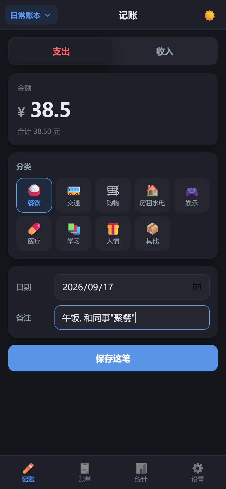
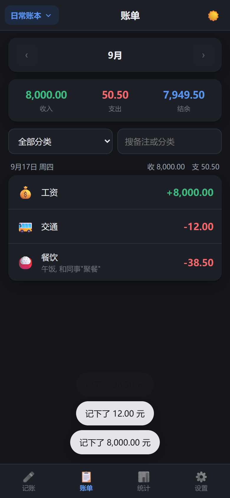
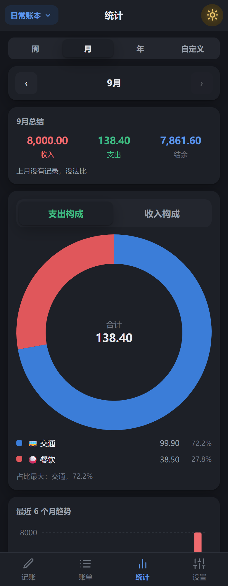
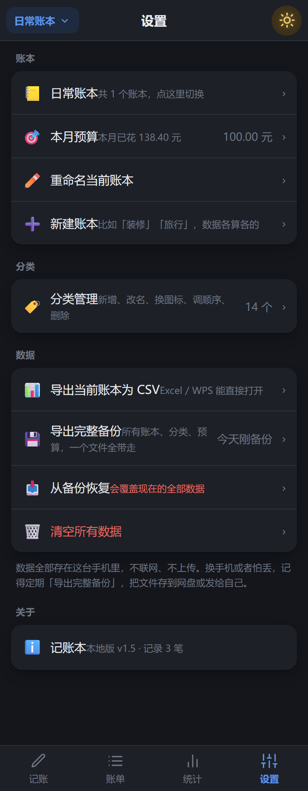
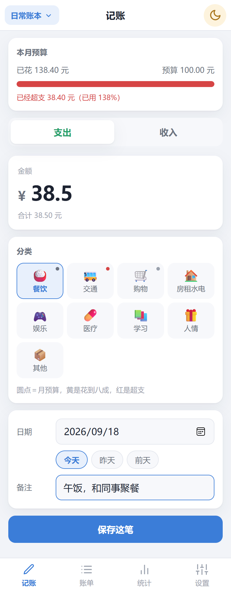

# 记账本

一个只在自己手机上用的记账 App。

**当前版本：v1.2** —— 在 v1.1 的基础上加了**分类预算**：给单个支出分类设月度上限，记账页的分类格上用一个小圆点显示超没超支（详见第七节）。

**不联网、不上传、不要账号、不要服务器** —— 所有数据都只存在手机本地，不装任何东西也能离线用。







---

## 一、装到手机上

**安卓和 iPhone 都支持。** 三条路，按你手头的条件挑一条：

| 你的设备 | 推荐走 | 需要什么 |
|---|---|---|
| 安卓手机 | A. 装 APK | 一台电脑（拷文件用） |
| iPhone，没有 Mac | **B. PWA 添加到主屏幕** | 电脑上跑个本地服务，或者任意一个能访问的网址 |
| iPhone，有 Mac | C. 原生 iOS App | Mac + Xcode |

---

### A. 安卓：装 APK

手机需要**安卓 5.1 以上**。

1. 把 `记账本-v1.2.apk` 下载到手机（或者用数据线从电脑拷过去）
2. 在手机上点开这个文件
3. 手机会提示「不允许安装未知来源的应用」。去 **设置 → 安全 → 安装未知应用**，允许你刚才用的那个程序（文件管理器 / 浏览器 / 微信）安装，然后再点一次
4. 装好后桌面上会出现「记账本」图标

> ⚠️ 根目录里那个 `记账本-v1.0.apk` 是**优化之前**的旧版，别装错了。
> 现在用的是 `记账本-v1.2.apk`（`versionName=1.2`、`versionCode=3`）。
>
> **升级路径**：v1.1 → v1.2 **用的是同一把签名密钥**，直接把新包装上去就行，
> 不用卸载，数据也不会动。
>
> 只有**从 v1.0 往上装**（不管是装 v1.1 还是 v1.2）才会报签名冲突 ——
> 因为签 v1.0 的那把钥匙和现在这把不是同一把（原因见第五节）。
> 这种情况先「设置 → 导出完整备份」，卸载旧版，装完再恢复。

> 换手机时靠 App 里的「导出完整备份」搬家，系统云备份是关掉的。

---

### B. iPhone：PWA 添加到主屏幕（不用 Mac、不用签名）

**不需要 Mac，不需要 Apple 开发者账号，不需要越狱。** 用 Safari 打开就能「装」到桌面，点开后是全屏的，有图标、没有网址栏，断网也能用——用起来和真 App 没什么区别。

1. 取得网页文件 —— **仓库里已经打好了，直接解压 `记账本-v1.2-pwa.zip` 就是**（里面就是整个站点，`index.html` 在最外层）。
   也可以用源码自己构建：
   ```bash
   npm install
   npm run build          # 产物在 dist/，内容和那个 zip 一样
   npm run preview        # 起一个本地服务，会打印 http://192.168.x.x:4173 之类的地址
   ```
   前者适合丢到静态托管（Vercel / Netlify / 对象存储 / 自家服务器都行，整包传上去即可）；
   后者只适合临时试，手机和电脑要连**同一个 Wi-Fi**。
2. **必须用 Safari** 打开那个地址（微信内置浏览器、iOS 版 Chrome / Edge 都不支持「添加到主屏幕」）。
3. 点底部中间的**分享**按钮（方框加向上箭头）→ 往下滑找到**「添加到主屏幕」**→ 右上角**添加**。
4. 回到桌面，会多出一个「记账本」图标。点开就是全屏，和原生 App 一样。

> **关于 iPhone 上的数据安全**：加到主屏幕之后，你的记账数据不会被 Safari「7 天不访问就清掉」那个机制回收——系统的自动清理只针对留在浏览器里的普通网页。但**卸载这个图标、或在 Safari 里「清除历史记录与网站数据」，数据一样会没**。所以每隔一两个月用「设置 → 导出完整备份」存一份到「文件」App 或网盘，别偷懒。

---

### C. iPhone：原生 App（有 Mac 的话）

> **先说清楚**：仓库里**没有** `.ipa` 安装包，这不是漏了 —— iOS 的安装包**只能在 macOS 上编译**，
> 需要 Xcode 和 CocoaPods，Windows 上做不了（本机确认 `pod` 和 `xcodebuild` 都不存在）。
> 所以 iPhone 日常用请走上面的 **B 方案（PWA）**，效果几乎一样；只有确实想要原生 App 时才需要 Mac。
> 代码本身已经全部就绪，`npx cap sync ios` 在 Windows 上也能跑，缺的只是最后一步编译。

要走这条路得有一台 Mac，而且装到自己手机上**不需要** 99 美元/年的开发者账号（用免费 Apple ID 就行，只是签名 7 天过期，到期重新连电脑点一下运行即可）。

```bash
npm install
npm run build
npx cap sync ios          # 把网页同步进 iOS 工程
npx cap open ios          # 会自动用 Xcode 打开 ios/App/App.xcworkspace
```

在 Xcode 里：选中左侧的 `App` 工程 → **Signing & Capabilities** → 填上你的 Apple ID（Team）→ 顶部选你的 iPhone → 点 ▶️ 运行。第一次装完，手机上要去 **设置 → 通用 → VPN 与设备管理** 里信任一下自己的开发者证书。

**以后每次改完代码，只要重跑一次：**
```bash
npm run build && npx cap sync ios
```
然后在 Xcode 里重新点 ▶️ 即可，不用再动工程配置。

> iOS 侧的图标和启动画面已经按苹果的规范生成好了（`AppIcon.appiconset` 一张 1024×1024 + `Splash.imageset` 三张 2732×2732），换图标只需要改 `assets/` 里的 SVG 再跑 `npm run icons`。


---

## 二、怎么用

底部四个页面。

### 记账

填金额 → 点分类 → 保存。三步就能记一笔。

- 上面切「支出 / 收入」，收入用绿色、支出用红色区分
- 保存后金额和备注会自动清空，分类回到第一个，方便连着记好几笔
- 日期旁边有「今天 / 昨天 / 前天」三个快捷键，补记前两天的账不用翻日历
- 金额框会自动纠正：不小心敲出 `1.2.3` 会被截成 `1.2`，只保留一个小数点、最多两位
- **设了预算的话**，页面顶部会有一条进度条：花到 80% 变黄，超了变红，并告诉你还差多少
- **给分类设了预算的话**，那个分类格的**右上角会有一个小圆点**：灰＝正常，黄＝花到八成，红＝本月已超支（怎么设见下面「设置」那一节）。圆点跟着**你选的日期所在的那个月**走，圆点下面也有一行图例说明
- **超过 30 天没导出过备份**，顶部会冒出一条黄色提示，点「×」可以暂时关掉

### 账单

按月看账，默认显示本月。

- 左右箭头翻月份
- 顶部是本月收入、支出、结余
- 下面按天分组，同一天的归在一起，组标题显示当天的收支小计
- **点任意一条记录**，可以：修改、再记一笔一样的（复制到今天）、删除
- **删除可以撤销** —— 删完底部会弹一条提示，6 秒内点「撤销」就回来了；过了就真删了
- 支持按分类筛选、搜备注或分类名。筛完之后顶部的合计会跟着筛选结果变，不会让你看错
- 左上角「**本月 / 全部时间**」切换：找很久以前的一笔（比如「三个月前买空调那笔」），切到「全部时间」再搜，不用逐月翻
- 从底部栏重新点「账单」，筛选会自动清掉，回到当月全貌

### 统计

- **支出构成 / 收入构成**：分类占比圆环图，下面列出每个分类的金额和百分比
- **点图例上的某个分类**，会直接跳到账单页看这个分类的明细
- **最近 6 个月趋势**：柱状图，绿的是收入、红的是支出
- **环比**：单月总结里会告诉你「比上月多花 412.30 元（+18%）」，花多了红、花少了绿
- 上方的月份箭头可以翻到以前看

### 设置

- **账本**：默认有一个「日常账本」。可以新建多个（比如「装修」「旅行」），各账本的数据和统计完全独立。顶部左上角可以随时切换
- **本月预算**：给当前账本设一个每月支出上限，填 0 表示不设
- **分类管理**：新增、改名、换图标、删除。支出和收入各有一套分类。每行右侧有上移/下移按钮，可以把常用的「餐饮」调到顺手的位置
- **分类预算**：在分类管理里点**任意一个支出分类**，面板里多一格「月预算」——填上这个分类每月的支出上限（填 0 或留空就是不设）。填完之后，记账页的分类格上会出现小圆点，分类管理每行也会显示「本月 38.50 / 100.00 元（39%）」，超支变红
  - 和上面那个「本月预算」互不影响：总预算管**整个月**的支出总额，分类预算只管**某一个分类**，可以只设其中一个
  - **只有支出分类有这一格**。把分类的「类型」改成收入，这一格会自动收起，原来的预算也会一并清掉（收入分类挂支出预算没有意义）
- **导出 CSV**：把当前账本导成 CSV，用 Excel 或 WPS 能直接打开。中文不会乱码
- **导出完整备份**：所有账本 + 分类 + 预算打成一个文件，换手机、防丢失用。导完会记下时间，下次进来显示「上次备份：X 天前」
- **从备份恢复**：选一个之前导出的备份文件恢复。**会覆盖现在的全部数据**，操作前会二次确认
- **清空所有数据**：字面意思，会问你两次

---

## 三、数据说明

- 数据存在手机里 App 自己的目录下（浏览器 IndexedDB），不上传到任何地方
- **这个 App 不会发起任何网络请求**，源码里一行 `fetch` / `XMLHttpRequest` 都没有
- 系统自动云备份**已关闭**，你的账本不会进谷歌云端
- 卸载 App 数据就没了 —— **建议每隔一两个月去「设置 → 导出完整备份」存一份到网盘**
- 金额一律按「分」存整数，不会出现 0.1 + 0.2 = 0.30000000000000004 那种小数误差

---

## 四、改代码 / 重新打包

### 技术栈

| | |
|---|---|
| 界面 | 原生 HTML / CSS / JavaScript，无框架 |
| 构建 | Vite 5 |
| 打包成 App | Capacitor 6（安卓 + iOS） |
| 数据存储 | IndexedDB（自己封装，无第三方库） |
| 图表 | 手写 SVG，不依赖任何图表库 |
| iPhone 免电脑安装 | PWA（`manifest.webmanifest` + `sw.js`，Safari 添加到主屏幕） |

选 Vite + Capacitor 的原因：**能先在电脑浏览器里把界面跑起来看效果，确认没问题再打包成手机 App**，改一次看一次，比直接装到手机上试快得多。

### 在电脑上跑起来

需要 Node.js 18 以上。

```bash
npm install        # 装依赖，只需跑一次
npm run dev        # 启动，浏览器打开 http://localhost:5173
```

### 自动检查功能有没有坏

改完代码后跑这个，它会用真浏览器把 68 项功能自动点一遍 —— 记账、编辑、删除、筛选、搜索、导出、备份恢复、多账本、总预算、分类预算（含圆点的三种颜色）、主题、刷新后数据是否还在，全部核对数字：

```bash
npm run dev        # 另开一个窗口保持运行
npm run verify     # 结果和截图输出到 tools/shots/
```

截图保存在 `tools/shots/`，哪一步出错了一眼就能看到。

### 打 APK

需要 JDK 17 和安卓 SDK。

```bash
npm run apk
```

这个命令会依次做三件事：编译网页 → 同步进安卓工程 → 用 Gradle 打包。产物在：

```
android/app/build/outputs/apk/release/app-release.apk
```

> **本机的工具链位置**（换电脑要改）：
> - JDK：`D:\android-build-tools\jdk`
> - 安卓 SDK：`D:\android-build-tools\sdk`
> - 脚本会自动设置 `JAVA_HOME` 和 `ANDROID_HOME`；装在别处的话先设好这两个环境变量
> - `android/local.properties` 里记着 SDK 路径，这个文件是每台机器自己的，没有进版本库

### 打包 iOS App

需要一台 Mac（装了 Xcode 和 CocoaPods）。

```bash
npm run build
npx cap sync ios      # 同步网页资源到 ios/App/App/public
npx cap open ios      # 用 Xcode 打开，选真机运行
```

> Windows 上 `npx cap sync ios` 也能跑（它只是把 `dist/` 拷进 iOS 工程、更新插件清单），
> 但 `pod install` 和 `xcodebuild` 会被自动跳过——这两步必须在 macOS 上做。
> 也就是说：**在 Windows 上改代码、同步资源完全可以，最后一步的编译和上机得在 Mac 上完成**。

### 换 App 图标 / 启动画面

改 `assets/` 里的 SVG（`icon-full.svg` 是老安卓用的整块图标，`icon-foreground.svg` 是自适应图标的前景层），然后：

```bash
npm run icons      # 一次生成安卓 + iOS + PWA 三套
```

这个脚本会用无头浏览器把 SVG 渲染成位图，然后按各平台规范铺开：

- **安卓**：`android/app/src/main/res/` 下各 dpi 的 `mipmap-*` 图标，以及启动画面
- **iOS**：读 `ios/App/App/Assets.xcassets/` 里两个 `Contents.json`，按里面声明的尺寸生成 `AppIcon-512@2x.png`（1024）和三张 `splash-2732x2732*.png`
- **PWA**：`public/icon-192.png`、`icon-512.png`、`icon-maskable-512.png`、`apple-touch-icon.png`（iPhone 主屏图标用的就是它）

> 想换成自己的图，最省事的做法是直接把 `assets/icon-full.svg` 里的图形换掉——它是矢量，放大到 1024 也不会糊。


### 推送到 GitHub

```bash
git add -A
git commit -m "说明这次改了什么"
npm run push
```

> **为什么用 `npm run push` 而不是 `git push`：**
> 这台电脑上 `github.com` 连不上（被墙），普通的 `git push` 会超时失败。
> 但 `api.github.com` 是通的，所以 `tools/push-to-github.mjs` 改走 GitHub 的
> REST 接口，把本地提交逐个复刻上去。
>
> 关键是它复刻的是**提交本身**（内容、作者、时间、父子关系都照抄），
> 因为 git 的哈希是按内容算的，所以远程算出来的哈希和本地完全一样 ——
> 两边不会分叉。脚本跑完会打印一行确认，说哈希一致就没问题。
>
> 如果哪天网络能正常访问 github.com 了，直接 `git push` 也能用，两种方式不冲突。

---

## 五、签名密钥（重要）

APK 是签过名的。**`android/jizhang.keystore` 和 `android/keystore.properties` 这两个文件必须保管好**：

- 以后出新版本，必须用同一把钥匙签名，否则新包装不到旧版上面，只能先卸载（数据就没了）
- 这两个文件**没有进版本库**，也不该进 —— 尤其是仓库公开的时候，任何人拿到钥匙都能签一个假 App 覆盖安装
- 请自己另存一份到网盘或 U 盘

> **现在的钥匙是哪一把**：签 v1.0 的那把钥匙没有随仓库带过来（本来就不该带），
> 所以 v1.1 是**新生成**的一把，和 v1.0 不是同一把。这意味着：
>
> - 手机上**没装过** v1.0 → 直接装 v1.2，没问题
> - 手机上**装的还是 v1.0** → 装 v1.2 会报签名冲突，必须先卸载。
>   卸载会清掉 App 数据，**先「设置 → 导出完整备份」再卸**，装完恢复回来即可。
> - 手机上**装的是 v1.1** → 直接装 v1.2 就行，**同一把钥匙**，不用卸载、数据不动。
>
> 从 v1.1 往后都用同一把钥匙，所以只要过了 v1.0 这一关，以后升级都不用再卸载了。

---

## 六、项目结构

```
├── index.html              页面骨架（顶栏、四个 Tab、底部导航）
├── CHANGELOG.md            更新记录：每个版本改了什么、下一轮可以做什么
├── 记账本-优化建议.md        v1.0 的 20 条问题清单（含文件行号与改法，优化已全部落地）
├── 记账本-v1.2.apk         安卓安装包
├── 记账本-v1.2-pwa.zip     iPhone 用的 PWA 包（解压后自托管，Safari 添加到主屏幕）
├── src/
│   ├── main.js             入口：启动、主题、Tab 切换、顶部账本切换
│   ├── db.js               IndexedDB 封装（增删改查、批量、清空）
│   ├── store.js            全部业务逻辑：账本、分类、记录、统计、导入导出
│   ├── utils.js            金额换算、日期、格式化、图表配色
│   ├── ui.js               弹层、确认框、轻提示、选项卡
│   ├── charts.js           手写 SVG 饼图和趋势柱状图
│   ├── fileio.js           导出/读取文件（浏览器下载 vs 安卓分享面板）
│   ├── nav.js              页面切换
│   ├── styles.css          全部样式（含深色模式）
│   └── views/
│       ├── txForm.js       记账表单（记账页和「修改记录」共用）
│       ├── record.js       记账页
│       ├── list.js         账单页
│       ├── stats.js        统计页
│       └── settings.js     设置页
├── public/                 PWA 用的静态资源（构建时原样拷进 dist/）
│   ├── icon.svg            矢量图标
│   ├── icon-192.png        主屏图标
│   ├── icon-512.png        启动画面大图 / 应用商店图
│   ├── icon-maskable-512.png   安卓自适应图标用
│   ├── apple-touch-icon.png    iPhone「添加到主屏幕」用的图标
│   ├── manifest.webmanifest    PWA 清单（名字、图标、全屏模式）
│   └── sw.js               Service Worker：断网时用缓存兜底
├── assets/                 图标源文件（SVG）和 1024 预览图
├── tools/
│   ├── build-apk.mjs       一键打包安卓
│   ├── make-icons.mjs      SVG → 安卓 / iOS / PWA 三套图标和启动画面
│   ├── verify.mjs          68 项自动化走查
│   └── push-to-github.mjs  走 GitHub API 推送（绕开被墙的 github.com）
├── docs/screenshots/       README 用的截图
├── android/                安卓工程（Capacitor 生成 + 少量手工配置）
└── ios/                    iOS 工程（Capacitor 生成，有 Mac 后用 Xcode 打开）
```

### 几处手工改过的安卓配置

重新生成安卓工程（`npx cap add android`）会覆盖掉，注意保留：

- `android/build.gradle` —— 加了阿里云 Maven 镜像（国内直连 google() / mavenCentral() 太慢）
- `android/gradle/wrapper/gradle-wrapper.properties` —— Gradle 发行版换成腾讯云镜像（`services.gradle.org` 在国内基本连不上）
- `android/app/build.gradle` —— 加了签名配置
- `android/app/src/main/AndroidManifest.xml` —— 关掉了系统云备份（`allowBackup="false"`）
- `android/app/src/main/res/` —— 图标和启动画面

### 几处手工改过的 iOS 配置

同理，`npx cap add ios` 重生成会覆盖（`cap sync ios` 只会覆盖 `public/`，不会动下面这些）：

- `ios/App/App/Info.plist` —— 应用名改成「记账本」；`UIRequiredDeviceCapabilities` 从模板默认的 `armv7` 改成 `arm64`（Capacitor 6 只支持 iOS 13+，全是 64 位设备，留着 armv7 反而会导致 App Store 校验报错）；开发区域设为 `zh_CN`
- `ios/App/App/Assets.xcassets/AppIcon.appiconset/` —— 1024×1024 应用图标
- `ios/App/App/Assets.xcassets/Splash.imageset/` —— 三张 2732×2732 启动画面

> iOS 工程里**没有**任何自定义 Swift 代码。备份文件的导入导出走的是 `<input type="file">` 加分享面板，iOS 16.4 以后系统的 WKWebView 原生支持，不需要额外写原生插件。

---

## 七、每个版本改了什么

一直是纯本地 App，**没有引入任何新框架、新依赖、新网络请求**。
逐版本的完整记录（含打包工具链踩过的坑）在 [`CHANGELOG.md`](CHANGELOG.md)，这里只讲用得上的部分。

### v1.2 —— 分类预算

以前只有一个「本月预算」总管全局。可「总支出超了 500」说明不了什么，**到底是哪一类超了**才是有用的问题。

- **怎么设**：设置 → 分类管理 → 点任意一个**支出**分类 → 「月预算」。填 0 或留空＝不设。
  收入分类没有这一格。
- **怎么看**：记账页的分类格**右上角一个小圆点** —— 灰＝正常，黄＝花到八成，红＝本月已超支。
  没设预算的分类不显示圆点；分类格下面有一行图例说明。
- **圆点跟的是哪个月**：**你选的日期所在的那个月**，不是「今天这个月」。
  补记上个月的账时，看到的是上个月花掉多少。
- **分类管理里也看得到**：每行显示「本月 38.50 / 100.00 元（39%）」，超支变红。
- **和总预算互不影响**：只设总预算、只设分类预算、两个都设，都可以。
- **老备份照常能恢复**：`budgetFen` 是分类上的新增可选字段 —— v1.0 / v1.1 的备份恢复进来，
  结果是「所有分类都没设预算」，和以前完全一样；v1.2 的备份拿到 v1.1 里也不会报错。
- **无障碍**：圆点是个纯色块，屏幕阅读器读不出来，所以每个带预算的分类格都补了说明文字
  （长按 / 读屏时会念「餐饮：本月已花 38.50 元，预算 100.00 元，还剩 61.50 元（已用 39%）」）。

### v1.1 —— 界面、排版与功能优化（v1.0 → v1.1）

改动集中在「手机上的观感」和「真正会用到但原来没有的功能」。逐条对照 `记账本-优化建议.md` 里的清单：

#### 界面与排版

| 原来的问题 | 现在的样子 |
|---|---|
| 顶栏标题因为左右按钮宽度不等而偏右 | 左右两列改成等宽，标题真正居中 |
| 底部导航用 `✏️📋📊⚙️` emoji，各品牌 ROM 渲染不一，还没法跟随主题变色 | 全部换成内联 SVG，颜色用 `stroke="currentColor"` 自动跟主题走，选中态不再割裂 |
| 饼图文字被放大 1.52 倍、趋势图文字被缩小到 0.89 倍，字阶是乱的 | 所有图表统一 `viewBox` 宽度基准，`.chart-wrap` 限宽，缩放比稳定在 1 附近 |
| 趋势图的「收入 / 支出」图例被 `flex:1` 推到屏幕两头 | 拆成两个独立分组，图标和文字贴在一起 |
| 间距混用 12 / 14 / 18 三套 | 统一成 `--gap-1` ~ `--gap-4`（8/12/16/24）一套 scale |
| 次级字号 11px 偏小 | 整体提到 12px |
| 统计页三个大数字宽度会随数字变化轻微抖动 | 补上 `font-variant-numeric: tabular-nums` |
| 分类名 6 个字在固定 5 列网格里被截断 | 网格改自适应 `auto-fill minmax(64px,1fr)`，名字放得下了 |

#### 功能

- **搜索/筛选支持「全部时间」** —— 账单页左上多了「本月 / 全部时间」切换，跨月搜「三个月前买空调那笔」不用逐月翻了。
- **删除可撤销** —— 删完不再立刻落库，底部弹一条带「撤销」的提示，6 秒内点一下就回来了。
- **统计页加了「环比」** —— 「X 月总结」下面多一行：`比上月多花 412.30 元（+18%）`，涨红跌绿。
- **分类可以排序** —— 设置里的分类管理每行右侧有上移/下移按钮，常用的「餐饮」可以调到顺手的位置。
- **备份提醒** —— 超过 30 天没导出过备份，「记账」页顶部会出现一条提示；导出后自动记下时间，设置页显示「上次备份：X 天前」。
- **记录快捷日期** —— 记账页加了「今天 / 昨天 / 前天」三个快捷按钮，补记昨天的账不用翻日历。
- **金额输入实时纠正** —— 输入 `1.2.3` 会被自动截成 `1.2`，不会再弹一条让人一头雾水的报错。

#### 兼容性与工程

- **切 Tab 记住滚动位置** —— 账单翻到下半截，去统计看一眼再切回来，位置还在。
- **iOS 全面适配** —— 输入框字号锁 16px（防 Safari 自动放大）、补 `touchstart` 让 `:active` 生效、`select` 去原生外观、滚动区域加 `-webkit-overflow-scrolling`。
- **PWA 离线可用** —— 加了 Service Worker，断网也能打开；原生 App 里会自动注销 SW，避免装新包后界面被旧缓存卡住。
- **清理死代码** —— 删掉 `db.get`、`db.clear`、`ui.pickOption`、`ui.field` 等没人调用的函数；那个建了但从没用过的 `ledger_date` 索引**保留**了，因为删索引要升 IndexedDB 版本号，会牵动老用户的数据，代价不划算，已加注释说明。
- **换了两个不安全的 emoji** —— 默认分类「其他」的图标从 `🧧`（Unicode 9.0）换成 `💵`，避免在安卓 5.1 的老字体上显示成方框。

#### 没有改的

- **`INTERNET` 权限**仍然保留。虽然代码里确实一行网络请求都没有，但去掉它需要真机逐一验证分享面板、文件导出，风险大于收益——**在 README 这里说明白：这个 App 不会发起任何网络请求**。
- **`minSdkVersion` 仍是 22（安卓 5.1）**，通过换 emoji 而不是抬门槛的方式绕过兼容问题。

